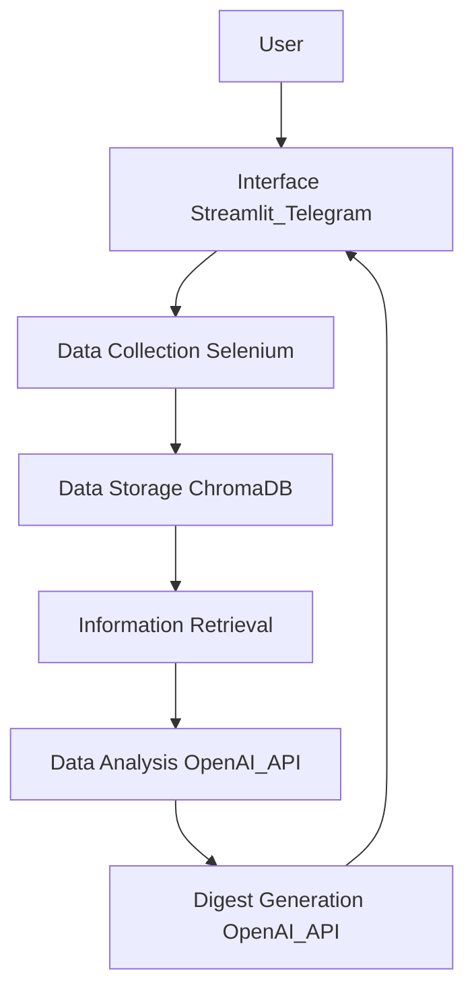

# Задача

Разработать прототип, который будет автоматически собирать и анализировать информацию с выбранных сайтов, формировать дайджест новостей и выделять самую важную информацию для ИТ подразделения.

## Подробнее о кейсе НЛМК

ИТ подразделение сталелитейной компании нуждается в оперативной информации о новейших продуктах, инициативах конкурентов, инновациях в системах хранения и управления данными, законодательных требованиях, открытиях и других событиях, которые могут повлиять на стратегию компании. В настоящее время поиск информации происходит вручную, что требует больших временных затрат и может привести к упущению важных событий.

## План действий команды

### 1. Подготовительный этап

#### 1.1 Сбор требований
- Определить конкретные потребности ИТ подразделения НЛМК.
- Составить список ключевых тем: новейшие продукты, инициативы конкурентов, инновации в системах хранения и управления данными, законодательные требования, открытия и т.д.
- Уточнить требования к формату дайджеста и периодичности обновлений.

  Список тем:
  Темы и компании для мониторинга:
1. Продукты и технологии:
   - Новейшие продукты в ИТ и металлургии.
   - Инновации в системах хранения и управления данными.
   - Прорывы в искусственном интеллекте и машинном обучении.

2. Конкуренты и стартапы:
   - Инициативы и проекты конкурентов.
   - Разработка и запуск стартапов в ИТ и металлургии.

3. Законодательные изменения:
   - Новые законодательные требования и нормативные акты.
   - Влияние законодательства на ИТ и металлургическую отрасль.

4. События и конференции:
   - Ключевые конференции и мероприятия в ИТ и металлургии.
   - Важные открытия и достижения в отрасли.

#### 1.2 Анализ источников
- Определить релевантные источники информации: новостные сайты, блоги, форумы, официальные сайты конкурентов и регуляторов.
- Составить список URL-адресов для мониторинга.

### 2. Архитектура системы

#### 2.1 Выбор технологий
- Язык программирования: Python.
- Библиотеки для веб-скрейпинга: Selenium.
- Система хранения данных: ChromaDB.
- Средства анализа данных: OpenAI API (GPT-4).
- Интерфейс для отображения результатов: Streamlit.

#### 2.2 Определение модулей системы
- Модуль сбора данных (веб-скрейпинг с использованием Selenium).
- Модуль хранения данных (ChromaDB).
- Модуль анализа данных с использованием OpenAI API.
- Модуль генерации дайджеста с помощью OpenAI API.
- Модуль отображения данных (Streamlit и Telegram Bot).

### 3. Разработка прототипа

## Архитектурная схема
1. **User**: Пользователь взаимодействует с интерфейсом через Streamlit или Telegram Bot.
2. **Interface (Streamlit_Telegram)**: Веб-интерфейс для отображения данных через Streamlit или Telegram Bot.
3. **Data Collection (Selenium)**: Модуль для сбора данных с выбранных веб-источников.
4. **Data Storage (ChromaDB)**: Система для хранения собранных данных.
5. **Information Retrieval**: Модуль для извлечения релевантной информации из хранилища данных.
6. **Data Analysis (OpenAI API)**: Анализ данных и генерация текста с помощью OpenAI API.
7. **Digest Generation (OpenAI API)**: Генерация дайджеста новостей на основе извлеченной и проанализированной информации.




## Запуск проекта
### Фронтенд
Исходный код фронтенда находится в директории *frontend*. Все дальнейшие команды этого раздела запускаются из данного каталога.
#### Настройка перед сборкой
Для конфигурации отображаемых страниц при запуске локального сервера и сборке статики указываются переменные:
* **VITE_LANG_SMITH_URL** - интерфейс управления Langchain LangSmith
* **VITE_GOOGLE_SHEETS_URL** - ссылка на таблицу с отранжированными статьями с указанием их рейтинга
* **VITE_DIGEST_TEMPLATE_URL** - ссылка на редактор LaTex для изменения шаблона PDF-дайджеста
#### Запуск локального сервера фронтенда
```shell
npm run serve
```
По умолчанию сервер доступен по адресу (http://localhost:3000)[http://localhost:3000]
#### Сборка фронтенда
```shell
npm run build
```
Артефакты сборки складываются в директорию *frontend/dist*.


